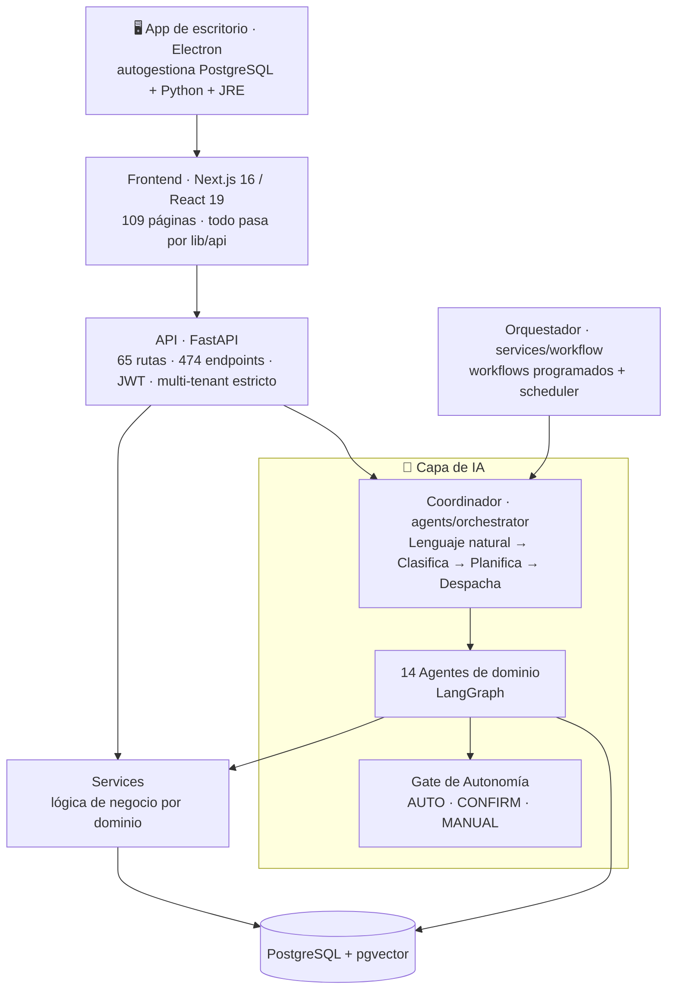
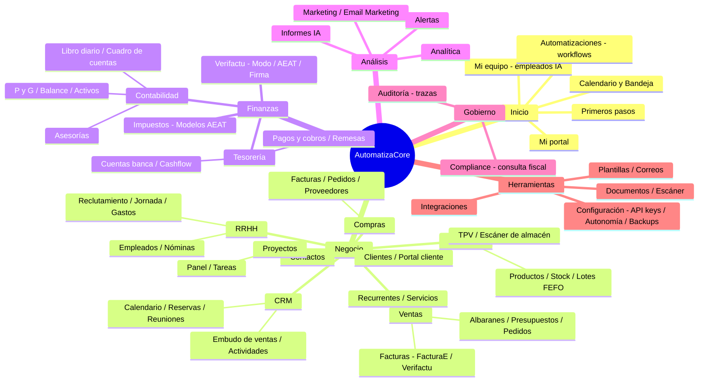
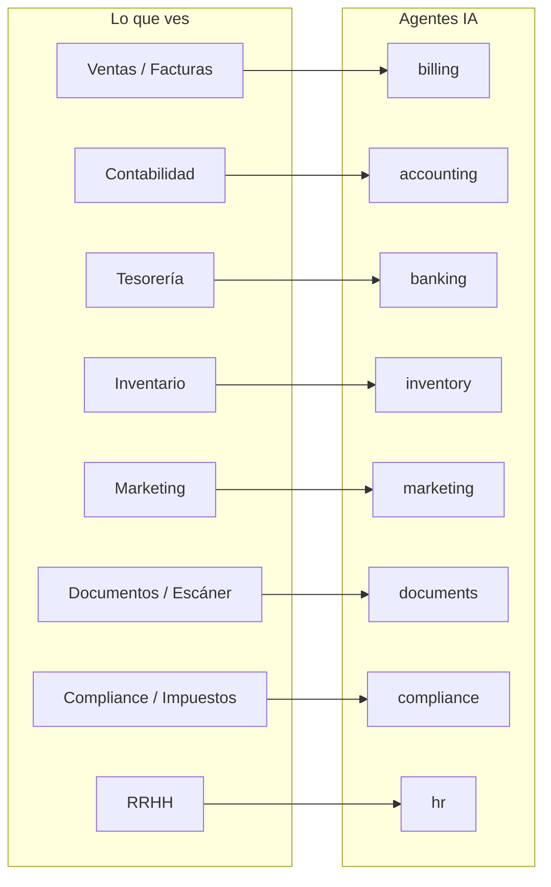

# Diagrama de módulos y funcionalidades — AutomatizaCore

> Mapa de la app tal como la ves (sidebar real) + la capa de IA que la mueve.
> Los diagramas son Mermaid: se renderizan en el preview de VS Code y en GitHub.
>
> 🔎 **Versión detallada, interactiva y contrastada con el código:** abre [`diagrama-proyecto/index.html`](diagrama-proyecto/index.html) · referencia en texto greppable: [`diagrama-proyecto/MAPA-PROYECTO.md`](diagrama-proyecto/MAPA-PROYECTO.md).

---

## 1. Arquitectura por capas (cómo está construido)

**En una frase:** escribes en lenguaje natural → el **Coordinador** decide qué **agente** actúa → el **Gate de autonomía** decide si ejecuta, pide confirmación o solo sugiere → la acción real la hacen los **Services** contra **PostgreSQL**. El **Orquestador** repite todo esto en automatizaciones programadas.

---

## 2. Módulos y funcionalidades (lo que ves en la app)

---

## 3. Los 14 agentes de IA (el "cerebro")

Cada agente vive en `backend/app/agents/<dominio>/` y su único contrato es ejecutar tareas de su dominio. El **Coordinador** los enruta; el **Gate de autonomía** controla qué pueden hacer solos.

| Agente | Qué hace | Autonomía por defecto |
|---|---|---|
| **Coordinador** (orchestrator) | Lenguaje natural → clasifica, planifica y despacha al agente adecuado | — |
| **billing** | Crea/emite facturas, FacturaE 3.2.2, Verifactu, numeración legal | `fiscal` = MANUAL (forzado) |
| **accounting** | Asientos, libro diario/mayor, cierre de periodo, Modelo 303, informes | CONFIRM |
| **banking** | Conciliación bancaria (import N43, auto-match) | banking_write = MANUAL |
| **crm** | Leads, embudo, actividades, agenda comercial | AUTO |
| **hr** | Nóminas, horarios, empleados | CONFIRM |
| **inventory** | Stock, lotes FEFO, reposición, ajustes | CONFIRM |
| **documents** | OCR/parse, clasifica, importa facturas de compra, indexa para RAG | CONFIRM |
| **compliance** | Consultas fiscales (RAG legal), calendario AEAT, BOE | AUTO (solo lectura); lo `fiscal` forzado a MANUAL |
| **marketing** | Posts, campañas, plan de contenidos, imágenes, redes (Zernio) | CONFIRM |
| **recruitment** | Puestos, candidatos, lectura de CV, pipeline | CONFIRM |
| **email** | Bandeja, enviar y responder correos (Gmail/Outlook/IMAP) | CONFIRM |
| **rag** | Búsqueda semántica y respuestas sobre tus documentos | AUTO |
| **excel** | Generación y análisis de hojas de cálculo | AUTO (no crítico) |

**Gate de autonomía** (`/configuracion/autonomia`): por cada dominio eliges **AUTO** (actúa solo), **CONFIRM** (prepara y espera tu clic) o **MANUAL** (solo sugiere). Lo fiscal está **forzado a MANUAL** por ley.

---

## 4. Cómo se conectan los módulos visibles con la capa de IA

---

*Generado el 2026-06-30. Para el detalle de comportamiento exacto vs esperado de cada feature, ver [`mapa-features-comportamiento.md`](mapa-features-comportamiento.md).*
