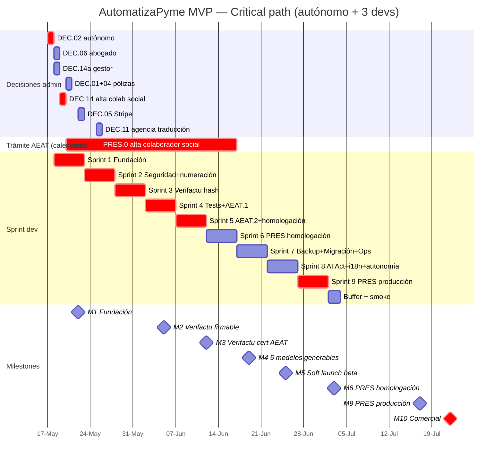

# Roadmap AutomatizaPyme — MVP comercial 22-jul-2026

> **Fuente**: consensuado en `DISCUSION_OTRA_IA.md` (31 rondas IA-1 ↔ IA-2). Backlog operativo detallado en [`tasks/backlog.md`](./backlog.md).

## §1 Supuestos

- **Hoy**: 2026-05-14 (jueves).
- **Rama decisión 2**: **autónomo** (responsabilidad civil ilimitada del fundador, asumida en póliza RC específica).
- **Equipo dev**: **3 devs** (1 backend senior + 1 fullstack + 1 frontend/UX).
- **Gestor profesional**: contratado para acelerar alta colaborador social AEAT (4 sem en lugar de 8).
- **Plan dev**: 125 días-persona / 3 devs ≈ 8.3 semanas + 1 sem buffer = **9 semanas dev**.
- **Comercial**: **22-jul-2026** (10 semanas desde hoy, condicional a PRES.0 cerrando en 4-6 sem).
- **Soft launch beta**: **25-jun-2026** (con 3-5 amigos firmados como beta-testers).

## §2 Decisiones administrativas esta semana — fechas-tope

| Día | Acción | Owner | Bloquea |
|---|---|---|---|
| **lun 18-may** | Firmar decisión 2: autónomo (DEC.02) | Fundador | Decisión 14 |
| **lun 18-may** | Contratar gestor especializado alta colaborador social AEAT (DEC.14a, ~600-1.000€) | Fundador | Alta AEAT |
| **lun 18-may** | Contratar abogado SaaS (DEC.06, 800-1.500€) | Fundador | EULA, DPA, dictámenes |
| **mar 19-may** | Solicitar cert pruebas FNMT (10 min online, gratis) | Gestor + dev1 | PRES.2'-4' homologación |
| **mié 20-may** | Aprobar presupuesto póliza E&O 1800-2400€ o Plan B (DEC.01) | Fundador | EULA y MVP |
| **mié 20-may** | Aprobar cert Code Signing EV ~400€/año (DEC.04) | Fundador | Build firmado |
| **jue 21-may** | Iniciar alta colaborador social AEAT vía gestor (DEC.14) | Gestor | PRES.0 |
| **vie 22-may** | Decisión Stripe vs Redsys (DEC.05) — default Stripe si silencio | Fundador | Suscripciones |

## §3 Critical path — sprint plan (9 sprints + buffer)

### Sprint 1 (18-22 may) — Fundación

**Objetivo**: descongelar lo bloqueante e incumplible-de-otro-modo.

| Dev | Tareas |
|---|---|
| Backend senior (dev1) | Alembic baseline + drift detection + DROP COLUMN `Candidate.score`/`score_breakdown` (ALB.1, ALB.2, ALB.3) |
| Fullstack (dev2) | AI.AUDIT exhaustivo a 3 capas (agents + services + db/models) + memo `docs/ai_act_scoping.md` (AI.AUDIT) |
| Frontend (dev3) | JWT a `safeStorage` + retirar `localStorage` en `client.ts` (SEC.JWT) |
| Compartido | Eliminar fallback `2026-04-20` literal en `compliance/tools.py` (CONT.0) |

**Gate de sprint**: Alembic baseline en CI, AI.AUDIT memo entregado, JWT migrado.

### Sprint 2 (25-29 may) — Seguridad + numeración

| Dev | Tareas |
|---|---|
| dev1 | Numeración correlativa `pg_advisory_xact_lock` + tabla `invoice_counter` (FAC.NUM) |
| dev1 | Retirar `score_candidate()` de `agents/recruitment` + `services/hr/commands.py` + `queries.py` (AI.SCO) |
| dev2 | Gate DevTools completo (F12 + menú + atajos + programático) en `desktop/main.js` (SEC.DEV) |
| dev2 | Rotación `SECRET_KEY` y `TENANT_ENCRYPTION_KEY` en primer arranque del instalador (SEC.KEY) |
| dev3 | UI.2 estados agente: streaming + skeleton + `CancellationToken` (UI.AGT) |

**Gate**: numeración correlativa testeada con concurrencia, AuditLog estructura confirmada.

### Sprint 3 (1-5 jun) — Verifactu chain hash

| Dev | Tareas |
|---|---|
| dev1 | Cadena hash Verifactu: `huella` + `huella_anterior` + tabla `verifactu_chain` append-only con triggers anti-UPDATE/DELETE (FAC.HASH) |
| dev1 | QR Verifactu en PDF + endpoint `/verify/{hash}` (FAC.QR) |
| dev2 | RLS Postgres real con `SET app.current_tenant` + policies (SEC.RLS) |
| dev2 | WORM lógico schema `audit_immutable` + rol `audit_writer` + superuser custodiado (SEC.WORM) |
| dev3 | UI.1 onboarding wizard 4 pasos + skip + vídeo 90s (UI.ONB) |

**Gate**: cadena hash verificable, RLS bloquea cross-tenant.

### Sprint 4 (8-12 jun) — Tests AEAT + modelos AEAT.1

| Dev | Tareas |
|---|---|
| dev1 | Tests integración Verifactu contra cert AEAT pruebas (FAC.TST) |
| dev1 | Generación Modelo 130 (IRPF fraccionado ED) (MOD.130) |
| dev2 | Generación Modelo 347 (operaciones >3.005€) (MOD.347) |
| dev2 | Generación Modelo 390 (resumen anual IVA) (MOD.390) |
| dev3 | UI.1 simulación modelo 303 al final del wizard (UI.SIM) |
| dev3 | UI.3 empty states productivos ~15 dominios (UI.EMP) |

**Gate**: Modelos 130/347/390 emitidos correctamente contra fixture, Verifactu pasa tests AEAT.

### Sprint 5 (15-19 jun) — Modelos AEAT.2 + presentación homologación

| Dev | Tareas |
|---|---|
| dev1 | Generación Modelo 111 (retenciones) (MOD.111) |
| dev1 | Generación Modelo 190 (resumen anual retenciones) (MOD.190) |
| dev2 | PRES.2' Modelo 303 contra **entorno homologación AEAT** (cert pruebas) (PRES.303) |
| dev2 | MANDATORY_HUMAN_FISCAL extendiendo `PendingApproval` + `AgentExecutionTrace` (SEC.APR) |
| dev3 | UI.4 densidad PYME/gestoría + selector empresa siempre visible (UI.DEN) |
| dev3 | UI.5 notificaciones nativas + bandeja persistente cross-session (UI.NOT) |

**Gate**: Modelos 111/190 emitidos, Modelo 303 enviado contra homologación con acuse simulado.

### Sprint 6 (22-26 jun) — Presentación PRES.3'+PRES.4' + backend service

| Dev | Tareas |
|---|---|
| dev1 | PRES.3' presentación 130+347+390 contra homologación (PRES.MOD1) |
| dev2 | PRES.4' presentación 111+190 contra homologación (PRES.MOD2) |
| dev2 | F.3 backend como servicio Windows persistente + tray vivo (DIS.SVC) |
| dev3 | UI.6 WCAG AA + `axe-core` en CI + testing manual NVDA (UI.A11Y) |
| dev3 | U.2 modal post-abort con coste tokens (UI.COST) |

**Soft launch interno**: 25-jun con 3-5 amigos beta-testers. Bug bash + feedback.

**Gate**: 5 modelos presentables contra homologación, build firmado funciona.

### Sprint 7 (29 jun - 3 jul) — Customer ops + backup + migración

| Dev | Tareas |
|---|---|
| dev1 | BACKUP local cifrado obligatorio + BACKUP.2 cadena Verifactu horaria a backup separado + BACKUP.3 banner >7d (BAK.LOC, BAK.VF, BAK.UI) |
| dev1 | BACKUP.1 opt-in Backblaze B2 cifrado E2E + restore wizard (BAK.B2) |
| dev2 | MIG.1 importador CSV genérico + MIG.2 Holded API + MIG.3 wizard 4 pasos con dry-run + rollback (MIG.*) |
| dev3 | O.3 PostHog self-hosted + eventos clave instrumentados (OPS.MET) |
| dev3 | O.1 SLA tiered en EULA + chat in-app Crisp configurado (OPS.SLA) |

**Gate**: backup local restaura correctamente, importador desde Holded funciona contra fixture.

### Sprint 8 (6-10 jul) — AI Act + i18n + autonomía

| Dev | Tareas |
|---|---|
| dev1 | `autonomy_policy(tenant_id, domain, mode)` con defaults seguros (banking-write=MANUAL) (SEC.AUT) |
| dev1 | A.6 `core/telemetry_scrubber.py` con whitelist + regex bloqueante NIF/IBAN (AI.SCR) |
| dev2 | AI.2 banner Art. 50 + footer "Generado por [proveedor]·[modelo]·[tokens]" (AI.BAN) |
| dev2 | A.14 metered billing Stripe + banner overage 450/500/+IVA (OPS.OVR) |
| dev3 | i18n cooficiales CA/EU/GA: UI + plantillas Facturae + selector idioma + integración traducciones agencia (I18N.*) |
| dev3 | U.3 empty states finalización + pulido visual (UI.POL) |

**Gate**: AI Act compliance verificable, traducciones cargadas, autonomía configurable.

### Sprint 9 (13-17 jul) — Presentación producción + última milla

**Asume**: PRES.0 (alta colaborador social) ha cerrado entre 15-jun y 30-jun. Cert representación AutomatizaPyme operativo.

| Dev | Tareas |
|---|---|
| dev1 | PRES.1' wizard REGAP con gating Cl@ve/cert FNMT + 3 ramas onboarding (PRES.REG) |
| dev1 | Conmutar PRES.2'-4' de homologación a **producción** + smoke test real cada modelo (PRES.PRD) |
| dev2 | PRES.5 deep-link a sede AEAT para 131+200 (asistido) (PRES.ASS) |
| dev2 | Kill-switch endpoints `/invoices` rechaza POST si healthcheck precondiciones falla (CONT.KILL) |
| dev3 | MULTI.2 invariante en `ARCHITECTURE.md` + `MARKETING.md` (MULTI.DOC) |
| dev3 | CI: pytest + mypy + lock versión Python instalador + cobertura mínima (QA.CI) |

**Gate**: presentación end-to-end contra producción AEAT con cert real funciona para los 5 modelos.

### §3.5 Visualización Gantt

### Buffer + Smoke real (20-21 jul)

- Bug bash final.
- Tests end-to-end con beta-testers reales.
- Generación de bundle release firmado.
- Documentación interna sprint-by-sprint actualizada.

### Comercial — 22-jul-2026

Landing pública + onboarding abierto + pricing 39/65/159€. Tier Gestoría disponible.

## §4 Track paralelo fundador (sin dev)

| Fecha | Acción | Coste |
|---|---|---|
| 14-may | Leer plan completo + decisiones esta semana | 0€ |
| 17-may | DEC.02 firmada (autónomo) | 0€ |
| 18-may | Contratar gestor (DEC.14a) | ~800€ |
| 18-may | Contratar abogado SaaS (DEC.06) | ~1.200€ |
| 20-may | Aprobar pólizas (DEC.01 + DEC.04) | inicio papeleo, pago al cierre |
| 21-may | Iniciar alta colaborador social (DEC.14) — vía gestor | trámite, no coste extra |
| 21-may | Solicitar cert representación FNMT (DEC.15) | ~50€ |
| 25-may | Contratar agencia traducción CA/EU/GA (DEC.11) | ~1.000€ |
| 1-jun | Firmar contratos beta-tester con 3-5 amigos (DEC.03) | 0€ |
| 1-jun | Recopilar 5 N43 reales por banco de los beta-testers (DEC.07) | 0€ |
| 1-jun | Decisión 3er dev (DEC.08) — ya tomada en supuestos, formalizar | salario × 9 sem |
| 1-jul | Decisión modelo soporte L1 (DEC.09) — fundador full-time inicial | 0€ inicial |
| Paralelo | Redactar O.2 KB 30-40 artículos | 6d esfuerzo |
| Paralelo | Redactar runbook incidente fiscal O.4 con abogado | 1d + ~300€ |
| Paralelo | 10-20 entrevistas ICP para validar pricing premium (nota §125) | 0€, 10-15h/sem |

## §5 Track paralelo legal (abogado contratado en DEC.06)

| Sprint | Entrega |
|---|---|
| 3 | EULA + Política Privacidad |
| 3 | DPA Art. 28 RGPD para clientes B2B |
| 4 | Checkbox renuncia derecho desistimiento (texto validado) |
| 4 | Dictamen `hr` termination structure-only (DEC.12, ~500€) |
| 5 | Dictamen AEAT.4 copy modelos no automatizados (DEC.13, ~500€) |
| 5 | Contrato apoderamiento cliente vía REGAP (DEC.16) |
| 6 | Runbook AEPD 72h (Art. 33-34 RGPD) |
| 6 | Verificación cobertura E&O o póliza RC específica (DEC.17) |

## §6 Milestones / gates

| Milestone | Fecha objetivo | Criterio |
|---|---|---|
| M1 — Fundación | 22-may | Alembic baseline + AI.AUDIT + JWT en safeStorage + numeración correlativa funcionando |
| M2 — Verifactu firmable | 5-jun | Cadena hash funcionando + QR en PDF + endpoint `/verify` |
| M3 — Verifactu certificado | 12-jun | Tests pasan contra cert AEAT pruebas |
| M4 — 5 modelos generables | 19-jun | 303, 130, 347, 390, 111, 190 emitidos contra fixture |
| M5 — Soft launch beta | 25-jun | 3-5 amigos usando build firmada con auto-update |
| M6 — Presentación homologación | 3-jul | 5 modelos enviados contra entorno preproducción AEAT con cert pruebas |
| M7 — Backup + migración | 3-jul | Restore local funciona, importador Holded funciona |
| M8 — AI Act + i18n + UX | 10-jul | AI.AUDIT cerrado, traducciones CA/EU/GA, WCAG AA con axe-core |
| M9 — Presentación producción | 17-jul | Cert representación real, 5 modelos contra AEAT producción con acuse |
| **M10 — Comercial** | **22-jul** | Landing pública + pricing + onboarding abierto |

## §7 Risk register

| ID | Riesgo | Probabilidad | Impacto | Mitigación |
|---|---|---|---|---|
| R1 | Alta colaborador social tarda 8 sem (no 4) | 40% | Comercial desplaza a 5-ago | Iniciar 21-may sin falta; gestor profesional con dossier completo |
| R2 | Dev senior se va a mitad de plan | 10% | Camino crítico cae | Contrato notice 30d + docs internas obligatorias por sprint + ARCHITECTURE.md vivo |
| R3 | AEAT publica cambio WSDL/formato durante dev | 20% | Re-trabajo 1-2 sem | Monitorización portal AEAT + buffer 3d en cada sprint Verifactu/PRES |
| R4 | Cert representación FNMT producción caduca a mitad de campaña (futuro) | 100% cada 2 años | Cae presentación todos los clientes | Monitoring T-60d + renovación T-45d + runbook si caduca por accidente (añadir a CONT.1 punto 6) |
| R5 | Cert AEAT pruebas caduca durante dev | 30% | Bloqueo 1-3d | Renovación T-15d en calendario interno |
| R6 | Stripe Tax cambia API | 15% | Re-trabajo 2-3d | Capa `BillingProvider` + tests integración semanales contra sandbox Stripe |
| R7 | Beta-testers no consiguen Cl@ve PIN/cert FNMT a tiempo | 30% | Presentación asistida no probada en soft launch | PRES.5 deep-link funciona desde día 1 sin Cl@ve; presentación real se prueba con el primer cliente que tenga firma |
| R8 | AI.AUDIT detecta nuevo agente high-risk no previsto | 25% | +2-4d para mitigar | Sprint 1 lo descubre, ajustar Escenario A al alcance ampliado antes del Sprint 4 |
| R9 | Validación empírica pricing (nota §125) demuestra que 39€ es alto | 35% | Pivot pricing post-soft-launch | Soft launch 25-jun da 4 sem de feedback antes de comercial |
| R10 | Póliza E&O no cubre "presentación tributaria en nombre de terceros" | 50% | +1.500-3.000€ póliza adicional | Verificar con broker en DEC.01 antes de firmar (R.A Ronda 26) |

## §8 Decisiones humanas — checklist consolidado

Las 17 decisiones consensuadas con sus fechas-tope, en orden cronológico:

- [ ] **17-may** DEC.02 Entidad facturadora (autónomo)
- [ ] **18-may** DEC.06 Contratar abogado SaaS (~1.200€)
- [ ] **18-may** DEC.14a Contratar gestor especializado (~800€)
- [ ] **20-may** DEC.01 Aprobar póliza E&O o Plan B EULA (1.800-2.400€ o 0€)
- [ ] **20-may** DEC.04 Cert Code Signing EV (~400€/año)
- [ ] **20-may** DEC.10 AI.1 Escenario A vs B (default A)
- [ ] **21-may** DEC.14 Iniciar alta colaborador social AEAT
- [ ] **21-may** DEC.15 Cert representación FNMT AutomatizaPyme (~50€)
- [ ] **22-may** DEC.05 Stripe vs Redsys (default Stripe)
- [ ] **25-may** DEC.11 Contratar agencia traducción CA/EU/GA (~1.000€)
- [ ] **1-jun** DEC.03 Contratos beta-tester 3-5 personas (0€)
- [ ] **1-jun** DEC.07 Recopilar 5 N43 reales por banco
- [ ] **1-jun** DEC.08 Confirmar 3er dev contratado (salario × 9 sem)
- [ ] **5-jun** DEC.12 Dictamen abogado laboralista termination (~500€)
- [ ] **12-jun** DEC.13 Dictamen abogado fiscalista AEAT.4 (~500€)
- [ ] **19-jun** DEC.16 Contrato apoderamiento REGAP (incluido en DEC.06)
- [ ] **1-jul** DEC.09 Modelo soporte L1
- [ ] **1-jul** DEC.17 Verificar cobertura E&O + póliza RC si necesario (~800€/año floor)

## §9 Tras el lanzamiento — v1.0.1+ y v1.1 (roadmap post-MVP)

**v1.0.1 - v1.0.3 (releases quincenales agosto-septiembre)**:
- 2 bancos más cada release hasta llegar a 10 (B.1)
- Bugfixes del soft launch + early adopters
- KB pública crece a 50 artículos

**v1.1 (Q4-2026)**:
- MIG.4 A3 (2.5d) + MIG.5 Sage 50 (3d)
- AEAT.3 modelos 131 + 200 (8d)
- PRES.6 Cl@ve PIN como alternativa a cert FNMT (3d)
- PSD2 banking vía partner Tink/GoCardless (si demanda lo justifica)
- FACe factura electrónica B2G (si entran clientes con AAPP)

**v1.2 (Q1-2027)**:
- MULTI.1 modo "Servidor compartido" LAN/Tailscale (8-10d)
- Pre-evaluación re-introducción `score_candidate()` con compliance AI Act completo (~30-60d + 5-15k€ organismo notificado) — solo si revenue lo justifica
- Roadmap macOS público confirmado

**Q4-2027**:
- Reevaluar Win10 22H2 (ESU caduca Q4-2027) → forzar Win11
- Modo gestoría como SKU separado si validado (decisión Año 2)
- Internacionalización fuera ES si hay tracción
